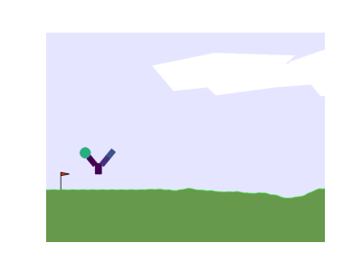
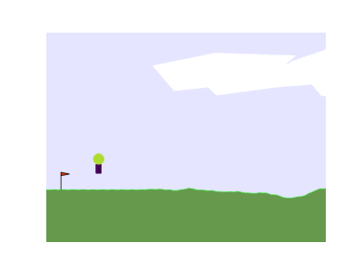
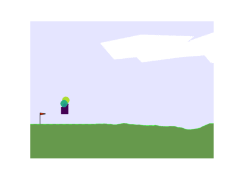
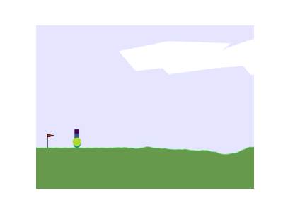
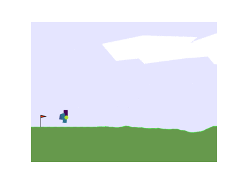

### Original parameters
| A | B |
|-------|-------|
|  |  |

---

### _decreased quantity_: Number of episodes per design reduced to 10% of the original value
| C | D |
|-------|-------|
|  |  |

---

### _decreased length_: Episode length reduced to 10% of the original value 
#### (Episode length same as during training)
| E | F |
|-------|-------|
|  |  |

---

### _decreased length_: Episode length reduced to 10% of the original value 
#### (Retrain the design with the original episode length)
| G | H |
|-------|-------|
|  |  |

